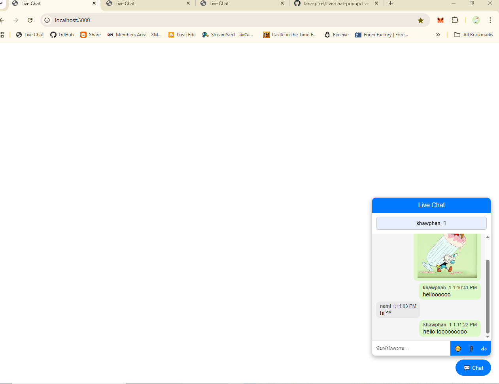
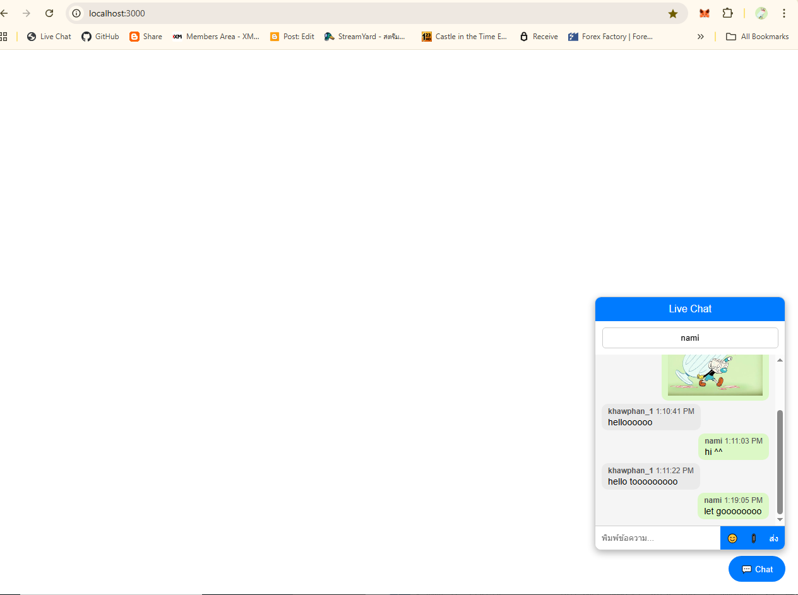
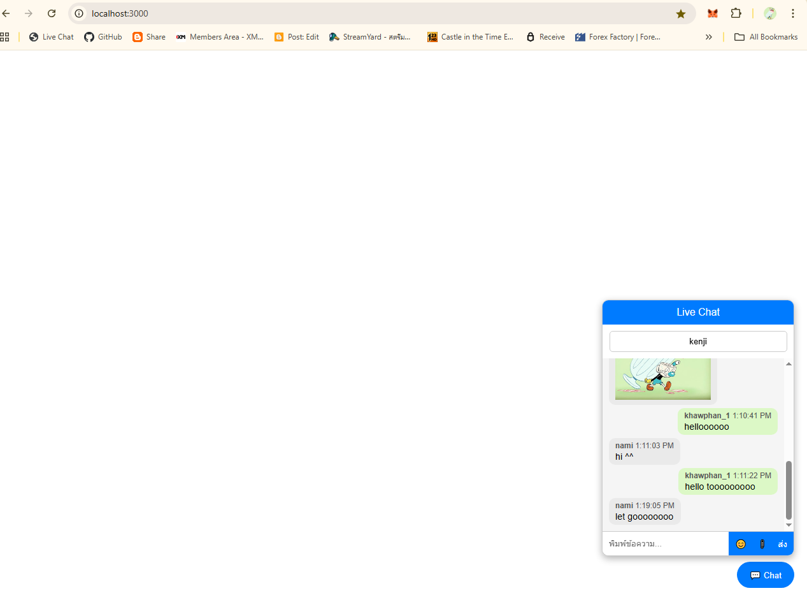

# Live Chat Popup 💬

## 📸 Screenshot ตัวอย่างโปรแกรม

### หน้าตาขณะ livechat คนที่ 1


### หน้าตาขณะ livechat คนที่ 2


### หน้าตาขณะ livechat คนที่ 3



Live Chat แบบ Popup บนเว็บ รองรับ:  

- ชื่อผู้ใช้  
- ข้อความแบบฝั่งซ้าย-ขวาเหมือน Messenger/WhatsApp  
- Emoji  
- ส่งรูปภาพ  
- แจ้งเตือนเสียงเมื่อมีข้อความใหม่  
- Responsive รองรับมือถือและ desktop  

---

## 💻 วิธีรันโปรเจกต์

1. **Clone repository**:

```bash
git clone https://github.com/username/live-chat-popup.git
cd live-chat-popup

🎨 ฟีเจอร์
ฟีเจอร์	รายละเอียด
📝 ชื่อผู้ใช้	ใส่ชื่อก่อนส่งข้อความ
💬 ฝั่งข้อความ	ตัวเองฝั่งขวา, คนอื่นฝั่งซ้าย
😊 Emoji Picker	ปุ่ม emoji แบบ popup
📎 ส่งรูปภาพ	เลือกรูปเพื่อส่งใน chat
🔔 แจ้งเตือนเสียง	เล่นเสียงเมื่อมีข้อความจากคนอื่น
📱 Responsive	ปรับ layout บนมือถือและ desktop

